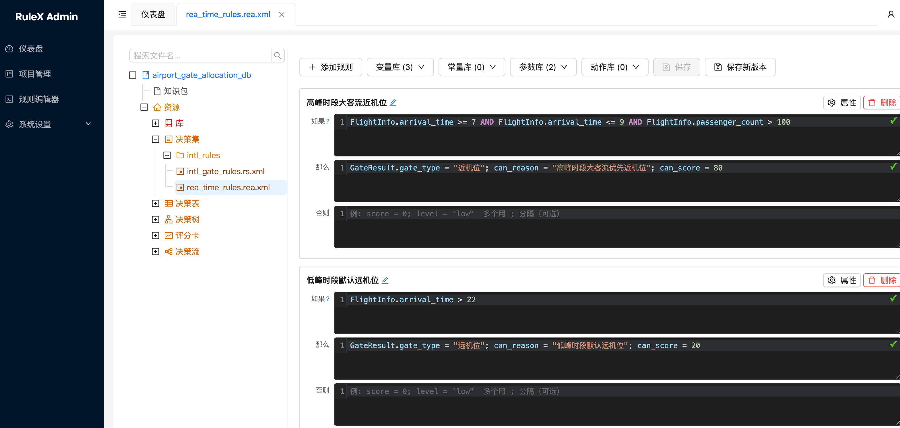

# RulEuler Rule Engine

[中文](readme.md) | English

An open-source rule engine built on the Rete algorithm. Separate business rules from code, manage them through visual editors or text expressions, with hot-reload support.



Default credentials: admin / asdfg@1234

## Quick Start (Docker)

```bash
cp .env.example .env
docker compose up -d --build
```

| Service | URL |
|---------|-----|
| Admin Console | http://localhost:16009/admin/ |
| Client API | http://localhost:16001 |
| MySQL | 127.0.0.1:3307 |

## Verify

```bash
curl -X POST http://localhost:16001/process/airport_gate_allocation_db/gate_pkg/gate_allocation_flow \
  -H 'Content-Type: application/json' \
  -d '{
  "FlightInfo": {
    "aircraft_type": "A380",
    "arrival_time": 8,
    "is_international": true,
    "passenger_count": 260
  },
  "GateResult": {}
}'
```

## Project Structure

```
├── ruleuler-core          # Core engine (Rete algorithm), do not modify
├── ruleuler-console       # Legacy admin servlet (editor rendering)
├── ruleuler-console-js    # Legacy editor frontend (webpack + React)
├── ruleuler-admin         # Modern admin frontend (Vite + React + Ant Design)
├── ruleuler-server        # Server (Spring Boot, JWT auth, REST API)
├── ruleuler-client        # Client (Spring Boot, rule execution API)
├── deploy/             # SQL init scripts
└── docs/               # Documentation
```

## Key Improvements over URule

| Area | URule | RulEuler |
|------|-------|-------|
| Storage | JCR (Jackrabbit) only | Added MySQL storage, per-project selection |
| Runtime | Spring Boot 2.x | Spring Boot 4.x + JDK 21 |
| Admin UI | jQuery + Bootstrap 3 | React 18 + Ant Design 5 |
| Rule editing | Wizard only | Added REA text expression editor |
| Variables | Requires Java POJO | GeneralEntity dynamic type |
| Access control | None | RBAC users/roles/permissions |
| Auto testing | None | Path coverage + test case batch generation & execution |
| Variable Monitoring| None | Execution trace paths, PSI/Enum drift, time-series anomaly alerts |
| Release & Gray | Save directly | Release approval workflow, Gray release (A/B), strict XML diff |
| Dependency Analysis| None | Full component upstream/downstream lineage & impact assessment |
| Audit Log | None | Operations playback for configuration & permission changes |
| Auth | None | JWT |

## Documentation

- [Full Documentation](https://sibosend.github.io/ruleuler/)
- [Client API](docs/api.md)
- [Server API](docs/api.internal.md)
- [REA Expression Syntax](docs/rea-expression.md)

## Testing

```bash
# Frontend
cd ruleuler-admin && pnpm test

# Backend
mvn test -pl ruleuler-server
```

## License

[Apache License 2.0](LICENSE)

This project is based on [URule](https://github.com/youseries/urule) (Copyright Bstek). See [NOTICE](NOTICE) for details.
