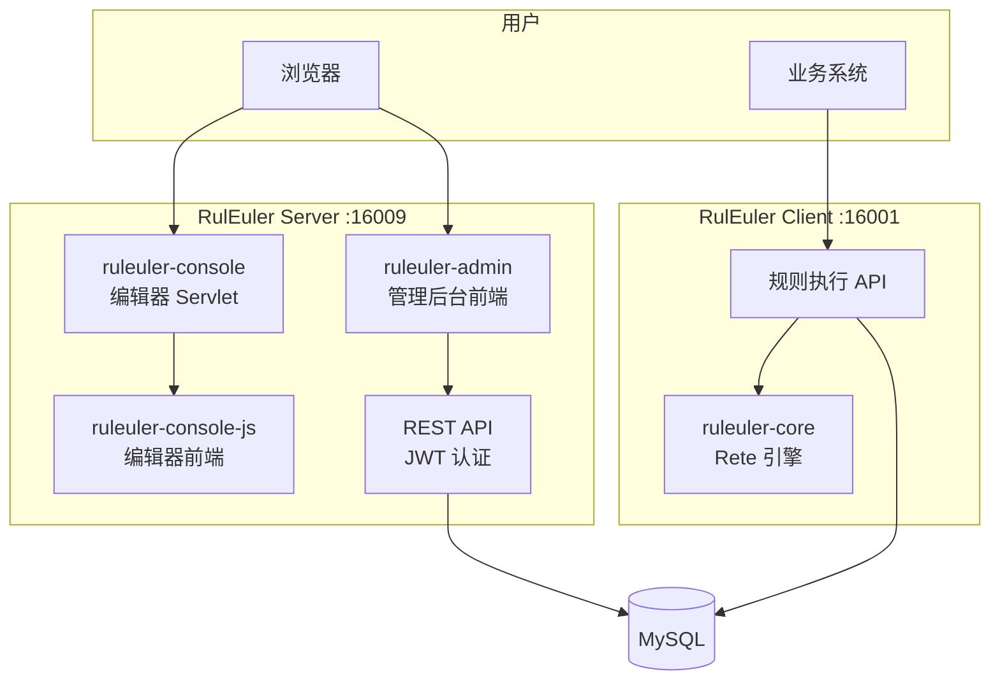

# 系统架构

## 模块结构

```
├── ruleuler-core              # 核心引擎（Rete 算法、模型定义）
├── ruleuler-console           # 管理后台 Servlet（编辑器页面渲染、文件操作）
├── ruleuler-console-js        # 编辑器前端（webpack + React，产出 *.bundle.js）
├── ruleuler-admin             # 新管理后台前端（Vite + React + Ant Design）
├── ruleuler-server            # 服务端（Spring Boot，JWT 认证，REST API）
├── ruleuler-client            # 客户端（Spring Boot，规则执行，对外 API）
```

## 架构图



## 模块职责

### ruleuler-core

核心引擎，实现 Rete 算法和规则模型定义。不轻易修改。

### ruleuler-server

Spring Boot 应用，提供：

- JWT 认证
- 项目/文件管理 REST API
- RBAC 权限控制
- 托管 ruleuler-admin 和 ruleuler-console 的静态资源

### ruleuler-client

Spring Boot 应用，提供：

- 决策流执行 API（`/process/...`）
- 知识包加载和缓存
- 变量提取 API

### ruleuler-admin

新管理后台前端，技术栈：Vite + React + TypeScript + Ant Design。

包含 REA 文本编辑器、项目管理、自动化测试等功能。

### ruleuler-console / ruleuler-console-js

旧版编辑器，基于 Servlet + webpack + React。提供决策表、决策树、决策流等可视化编辑器。

## 技术栈

| 层 | 技术 |
|----|------|
| 后端 | Java 21, Spring Boot, Maven |
| 前端（新） | React, TypeScript, Vite, Ant Design |
| 前端（旧） | React, webpack, bundle.js |
| 数据库 | MySQL 8.0+ |
| 规则引擎 | Rete 算法 |
| 认证 | JWT |
| 部署 | Docker Compose |
