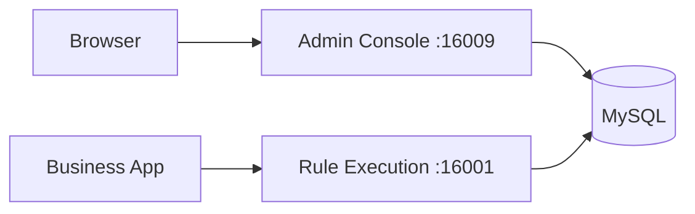
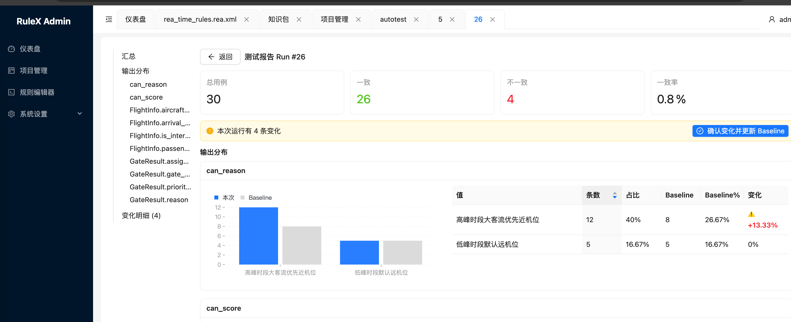

# RulEuler Rule Engine

RulEuler is an open-source rule engine built on the Rete algorithm. It separates business rules from application code, enabling rule management through both visual editors and text expressions, with hot-reload support.

## What Problem Does It Solve

Business systems are often cluttered with if-else logic for risk control, approval workflows, pricing strategies, and resource allocation. Every change requires code modifications, testing, and redeployment. RulEuler lets business users configure rules directly in the admin console — changes take effect immediately, no code changes needed.

## Use Cases

- Risk decisions — credit scoring, anti-fraud rules, credit limit approval
- Business approvals — multi-level approval workflows, conditional routing
- Dynamic pricing — promotion rules, discount strategies, tiered pricing
- Resource allocation — gate assignment, ticket dispatching, load balancing
- Compliance checks — data validation rules, regulatory compliance

## Background

RulEuler is a fork of URule 2.1.6 (Bstek open-source edition). URule has a solid core engine, but its JCR storage model is not intuitive for most developers, and some capabilities needed improvement. RulEuler keeps the core engine intact and adds the following:

| Area | URule Open Source | RulEuler |
|------|-------------------|-------|
| Storage | JCR (Jackrabbit) only | Added MySQL relational storage, per-project selection |
| Runtime | Spring Boot 2.x | Spring Boot 4.x + JDK 21 |
| Admin UI | jQuery + Bootstrap 3 | Added React 18 + Ant Design 5 modern admin |
| Rule editing | Tedious wizard-only | Added REA text expression editor |
| Variable definition | Requires Java POJO | GeneralEntity dynamic type, just field name + type |
| Access control | None | RBAC users/roles/permissions |
| Auto testing | None | Path coverage + MC/DC auto-generated test cases |
| Authentication | None | JWT authentication |

## Key Features

- Visual rule editing — decision tables, decision trees, rule flows, scorecards
- REA text editor — write rules in natural-language-style expressions
- Rete algorithm — efficient pattern matching for high-volume rule execution
- Multiple rule types — rule sets, decision tables, decision trees, rule flows, scorecards
- Hot reload — rules update automatically after saving, no restart needed
- Auto testing — auto-generate test cases with regression comparison
- RBAC — user, role, and project-level access control

## Architecture



- Admin console (ruleuler-server + ruleuler-admin) — rule editing, project management, access control
- Rule execution (ruleuler-client) — loads knowledge packages, executes rule flows, exposes REST API
- Two services deployed independently, sharing rule data via MySQL




## Quick Start

```bash
git clone https://github.com/sibosend/ruleuler.git
cd ruleuler
cp .env.example .env
docker compose up -d --build
```

Once started, visit [http://localhost:16009/admin/](http://localhost:16009/admin/). Default credentials: `admin` / `asdfg@1234`.

## Invoke Rules

```bash
curl -X POST http://localhost:16001/process/airport_gate_allocation_db/gate_pkg/gate_allocation_flow \
  -H 'Content-Type: application/json' \
  -d '{
  "FlightInfo": {
    "aircraft_type": "A380",
    "arrival_time": 8,
    "is_international": true,
    "passenger_count": 260
  },
  "GateResult": {}
}'
```
