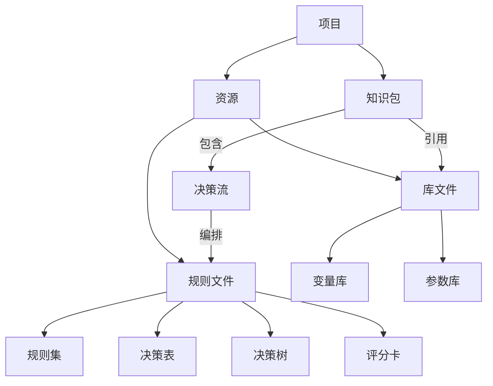
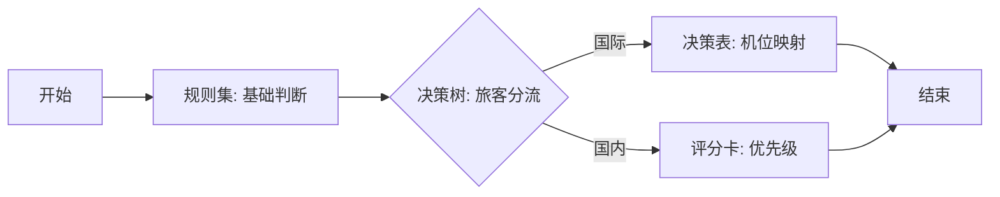
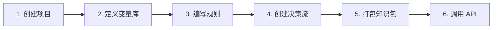

# 核心概念

## 概念关系



一句话总结：项目下有资源和知识包两大块。资源存放库文件和规则文件。知识包引用库文件、包含决策流，决策流编排规则文件。

## 项目

项目是顶层容器，所有规则资源都归属于某个项目。项目下有两个固定分区：

- 知识包 — 规则的打包发布单元
- 资源 — 库文件和规则文件的存放位置

```
airport_gate_allocation_db/       # 项目
├── 知识包/
│   └── gate_pkg                  # 打包发布单元
└── 资源/
    ├── 库/                        # 库文件
    │   ├── flight_info.vl.xml    # 变量库
    │   ├── gate_result.vl.xml
    │   └── canshu0.pl.xml        # 参数库
    ├── 决策集/                    # 规则文件
    │   └── intl_gate_rules.rs.xml
    ├── 决策表/
    │   └── aircraft_gate_map.dt.xml
    ├── 决策树/
    │   └── pax_gate_routing.dtree.xml
    ├── 评分卡/
    │   └── flight_priority_score.sc
    └── 决策流/
        └── gate_allocation_flow.rl.xml
```

创建项目时选择存储模式（db 或 jcr），创建后不可更改。推荐 db。

## 资源：库文件

库文件定义规则中使用的数据结构，是规则的"词汇表"。

### 变量库（.vl.xml）

最核心的库文件。定义输入/输出变量，按类别分组。

每个变量类别对应 API 请求体中的一个顶层 key：

```json
{
  "FlightInfo": {          ← 变量类别
    "aircraft_type": "A380",  ← 变量
    "arrival_time": 8
  },
  "GateResult": {}         ← 输出类别，规则执行后填充
}
```

详见 [变量定义](general-entity.md)。

### 参数库（.pl.xml）

定义中间变量，不属于任何类别。用于规则间传递临时数据，如 `can_score`、`can_reason`。

参数出现在 API 返回结果的顶层（不在任何类别下）。

### 常量库（.cl.xml）和动作库（.al.xml）

常量库定义固定值，动作库定义可调用的 Java 方法。一般项目用不到。

## 资源：规则文件

规则文件定义具体的业务逻辑。每种类型适合不同场景：

| 类型 | 扩展名 | 一句话 | 什么时候用 |
|------|--------|--------|-----------|
| 规则集 | `.rs.xml` | 一组 if-then-else | 简单条件判断，规则不多 |
| 决策表 | `.dt.xml` | 条件 × 结果的矩阵 | 条件组合多，需要一目了然 |
| 决策树 | `.dtree.xml` | 树形分支 | 条件有先后层级 |
| 评分卡 | `.sc` | 每项打分再汇总 | 信用评分、风险评估 |
| 决策流 | `.rl.xml` | 串联多个规则节点 | 复杂流程，多步骤协作 |

规则文件支持文件夹组织（如 `intl_rules/asia/`）。

规则集支持两种编辑方式：向导式和 [REA 文本编辑器](rea-expression.md)。

## 知识包

知识包是连接"编辑"和"执行"的桥梁，也是对外调用的入口。

知识包引用库文件和决策流，将它们编译打包成一个可执行单元。决策流是知识包的一部分，不是独立于知识包存在的。

```
知识包 gate_pkg
├── 引用变量库: flight_info.vl.xml, gate_result.vl.xml
├── 引用参数库: canshu0.pl.xml
└── 包含决策流: gate_allocation_flow.rl.xml    ← 对外调用入口
    ├── 节点1: 规则集 intl_gate_rules.rs.xml
    ├── 节点2: 决策表 aircraft_gate_map.dt.xml
    ├── 节点3: 决策树 pax_gate_routing.dtree.xml
    └── 节点4: 评分卡 flight_priority_score.sc
```

一个知识包可以包含多个决策流，每个决策流是一个独立的执行入口。

知识包支持热更新——修改规则保存后，客户端自动加载最新版本，无需重启。

## 决策流

决策流是知识包内的执行流程，通过可视化流程图编排规则节点的执行顺序：



决策流中的每个节点引用一个规则文件（规则集、决策表、决策树或评分卡）。执行时按流程图的连线顺序依次执行各节点。

调用方式：

```
POST /process/{project}/{packageId}/{flowId}
```

其中 `packageId` 指定知识包，`flowId` 指定该知识包内的哪个决策流。

## 完整流程



以机场登机口分配为例：

1. 创建项目 `airport_gate_allocation_db`
2. 定义变量库：`FlightInfo`（输入）、`GateResult`（输出）、参数库（中间变量）
3. 编写规则：决策表映射机型→机位，决策树按旅客数分流，评分卡算优先级
4. 创建决策流 `gate_allocation_flow`，串联上述规则
5. 创建知识包 `gate_pkg`，引用所有库和决策流
6. 调用：

```bash
curl -X POST http://localhost:16001/process/airport_gate_allocation_db/gate_pkg/gate_allocation_flow \
  -H 'Content-Type: application/json' \
  -d '{"FlightInfo": {"aircraft_type": "A380", "arrival_time": 8, "is_international": true, "passenger_count": 260}, "GateResult": {}}'
```

## Rete 算法

RulEuler 使用 Rete 算法进行规则匹配。Rete 构建规则网络避免重复计算条件，大量规则场景下性能显著优于逐条匹配。用户无需关心内部实现。
