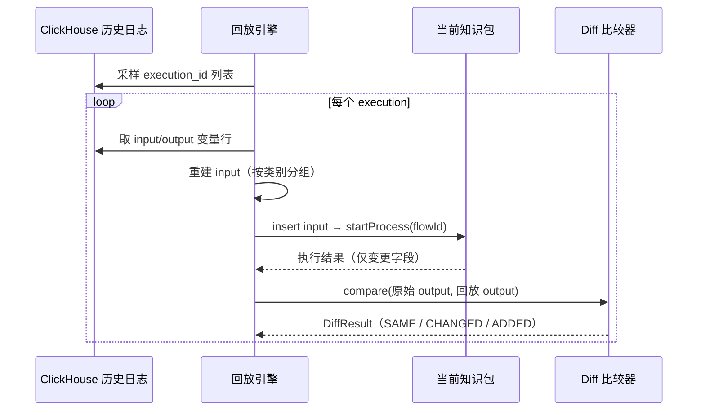

# 流量回放

流量回放用于验证策略变更的影响：从 ClickHouse 历史日志中取出真实请求，用当前版本的知识包重新执行，将结果与原始输出逐字段比对。

## 工作原理

核心流程：

1. 从 ClickHouse `execution_var_log` 表采样历史执行 ID
2. 按 execution_id 取出所有变量行，重建 input 和 original output
3. 用当前知识包本地执行回放（不走 HTTP，直接 KnowledgeSession）
4. 回放输出只保留相对于 input 有变更的字段（与日志记录逻辑对齐）
5. 逐字段比对原始输出和回放输出，生成差异报告

## 采样策略

| 策略 | 说明 |
|------|------|
| `random` | 随机采样，适合快速验证 |
| `uniform` | 均匀采样，覆盖时间段内各时段 |
| `all` | 全量回放，适合精确验证 |

## 缺失变量处理

历史日志可能缺少部分变量（新增变量、日志丢失等），提供三种策略：

| 策略 | 说明 |
|------|------|
| `segment` | 用变量定义的默认值或类型零值填充，标记为 INCOMPLETE |
| `null` | 不填充，缺失变量传 null |
| `skip` | 跳过不完整的请求 |

## 差异比对

比对结果按字段粒度，每个字段标记为：

| 状态 | 含义 |
|------|------|
| SAME | 原始值与回放值一致 |
| CHANGED | 值发生变化 |
| ADDED | 回放新增了原始没有的字段 |
| REMOVED | 原始有但回放没有的字段（回放未触发该规则） |

支持数值容差配置（精确匹配 / 绝对容差 / 相对容差），避免浮点精度导致的误报。

## 使用方式

### 从项目页面进入

项目详情 → 流量回放，自动关联当前项目和知识包。

### 从上线管理进入

上线管理 → 流量回放，需要先选择项目和知识包。

### 操作步骤

1. 选择知识包、时间范围、采样策略
2. 点击"创建"启动回放任务
3. 任务列表实时显示进度
4. 查看报告：一致率、变量维度差异统计、耗时对比
5. 查看明细：逐条查看每个请求的 Diff 详情
6. 导出：将回放结果导出为自动测试用例包，用于后续回归测试

## 回放报告

报告包含：

- **概览**：总数、一致数、不一致数、失败数、一致率
- **变量维度统计**：每个输出变量的变化次数和变化率，快速定位受影响的字段
- **耗时对比**：原始执行 vs 回放执行的平均耗时和 P95 耗时

## 导出为测试用例

回放结果可以导出为自动测试用例包，支持三种范围：

- 全部导出
- 仅导出不一致的请求
- 仅导出一致的请求

导出后可在自动测试模块中执行回归测试。

## 前置条件

- ClickHouse 已配置并有历史执行日志（需开启变量监控）
- 知识包已发布且可正常加载
