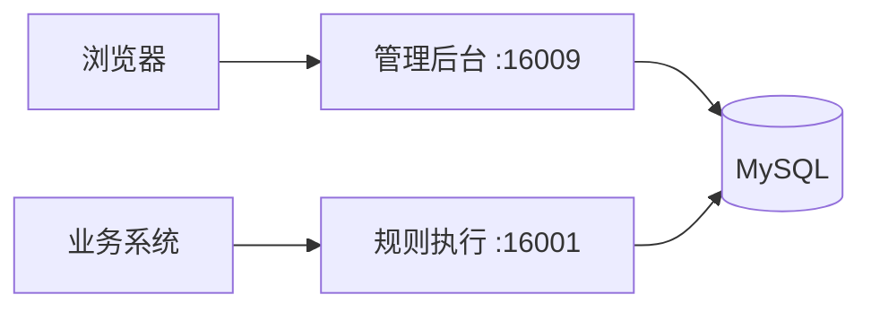

# RulEuler 规则引擎

RulEuler 是一个基于 Rete 算法的开源规则引擎，将业务规则从代码中剥离，通过可视化编辑和文本表达式两种方式管理规则，实现规则的热更新和独立维护。

## 解决什么问题

业务系统中大量的 if-else 判断逻辑（风控策略、审批流程、定价规则、资源分配）散落在代码里，每次调整都要改代码、测试、发版。RulEuler 让业务人员直接在管理后台配置规则，修改即时生效，开发不用碰代码。

## 适用场景

- 风控决策 — 信用评分、反欺诈规则、额度审批
- 业务审批 — 多级审批流程、条件分支路由
- 动态定价 — 促销规则、折扣策略、阶梯计价
- 资源分配 — 机位分配、工单派发、负载均衡策略
- 合规校验 — 数据校验规则、业务合规检查

## 项目背景

RulEuler 基于 URule 2.1.6（Bstek 开源版）二次开发。URule 的核心引擎成熟可靠，但其 JCR 存储模型对多数开发者不够直观，部分能力也有提升空间。RulEuler 在保留核心引擎的基础上做了以下改进：

| 改进项 | URule 开源版 | RulEuler |
|--------|-------------|-------|
| 存储方式 | 仅 JCR（Jackrabbit） | 新增 MySQL 关系表存储，按项目选择 |
| 运行时框架 | Spring Boot 2.x | Spring Boot 4.x + JDK 21 |
| 管理后台 | jQuery + Bootstrap 3 | 新增 React 18 + Ant Design 5 现代化后台 |
| 规则编辑 | 操作过程繁琐 | 新增 REA 文本表达式编辑器 |
| 变量定义 | 需预定义 Java POJO | 使用 GeneralEntity 动态类型，只需字段名+类型 |
| 权限控制 | 无 | RBAC 用户/角色/权限体系 |
| 自动测试 | 无 | 基于路径覆盖 + MC/DC 自动生成测试用例 |
| 认证 | 无 | JWT 认证 |

RulEuler 保留了 URule 的核心引擎不做修改，改进集中在服务端、管理后台和客户端。

## 核心特性

- 可视化规则编辑 — 决策表、决策树、决策流、评分卡，拖拽式配置
- REA 文本编辑器 — 用自然语言风格的表达式编写规则，效率更高
- Rete 算法驱动 — 高效的模式匹配，适合大量规则并发执行
- 多种规则类型 — 规则集、决策表、决策树、决策流、评分卡
- 知识包热更新 — 规则修改后客户端自动加载，无需重启
- 自动测试 — 基于路径覆盖自动生成测试用例，回归比对输出变化
- RBAC 权限控制 — 用户、角色、项目级权限管理

## 架构概览



- 管理后台（ruleuler-server + ruleuler-admin）— 规则编辑、项目管理、权限控制
- 规则执行（ruleuler-client）— 加载知识包，执行决策流，对外提供 REST API
- 两个服务独立部署，通过 MySQL 共享规则数据


## 30 秒体验

```bash
git clone https://github.com/sibosend/ruleuler.git
cd ruleuler
cp .env.example .env
docker compose up -d --build
```

等待启动完成后访问 [http://localhost:16009/admin/](http://localhost:16009/admin/)，默认账号 `admin` / `asdfg@1234`。

## 调用规则

```bash
curl -X POST http://localhost:16001/process/airport_gate_allocation_db/gate_pkg/gate_allocation_flow \
  -H 'Content-Type: application/json' \
  -d '{
  "FlightInfo": {
    "aircraft_type": "A380",
    "arrival_time": 8,
    "is_international": true,
    "passenger_count": 260
  },
  "GateResult": {}
}'
```

## 下一步

- [Docker 快速启动](getting-started/quickstart.md) — 零依赖，5 分钟跑起来
- [核心概念](guide/concepts.md) — 理解决策流、知识包、变量类别
- [客户端 API](api/client-api.md) — 集成规则引擎到你的系统
